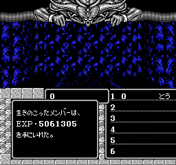
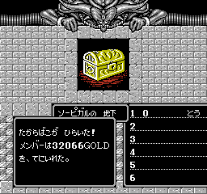
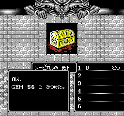
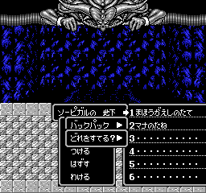

+++
title = "0 体撃破バグ"
+++

戦闘終了時に「倒した敵の数」が 0 体の場合、バグによりメモリの海の中の敵を 256 体倒したものとして処理される (該当コード: PRG 20 `$97D7`)。これにより莫大な経験値を入手できる。

ただし、本作は戦闘中に逃げた敵の管理がバグっており、敵が全員逃げたとしても大抵は数体倒した扱いになるため、この状況は滅多に起こらない。これを狙って起こす方法の一例を示す ([再現用ムービー](MightAndMagicJ-beat0bug.bk2)):

* 主人公の一時効果抜きレベルを 4 まで上げ、主人公 1 人PTにする。
* ソーピガルの地下でランダム編成エンカウントを起こし、最も逃げやすい(主人公の一時効果抜きレベルが 4 以上で逃げる)敵が 1 体で現れるまで粘る。
* 戦闘に入ったら防御し続け、敵が逃げるのを待つ。

無事に敵が逃げ出した場合、以下のように莫大な経験値が入る。
運次第だが、お宝の内容もかなり良いものとなる (GOLD, GEM に関してはオーバーフローが発生しうる。なお、通常範疇で出現しないアイテムはこのバグを使っても出ない)。

   

この手順はあくまで一例であり、他にも以下のような方法が考えられる:

* 成長の薬で一時効果込みレベルをオーバーフローさせ、1 体エンカウントを狙う
* 1 体エンカウントが起こりやすいイベントを利用する
