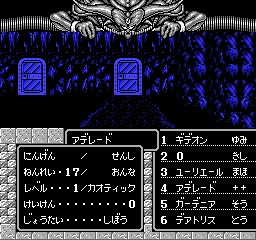

+++
title = "オクリムバグ"
+++

[森のあばら屋地下1](@/map/map-46/_index.md)でオクリム戦をこなした後に (12, 12) に再度進入するとオクリムとの会話が始まり、命を差し出すかどうか聞かれるが、ここで「はい」と答えた場合の処理には重大な不具合がある。

命を差し出す場合、本来の仕様では「PT先頭の者が死亡する」はずだったと思われるが、これは主人公 (味方キャラID 0) がPT先頭にいる場合しか成り立たない。そうでない場合、PT先頭の者の[味方キャラID](@/hero/_index.md)およびRAMの内容に依存して異常な処理が行われる。

まず、PT先頭の者が味方キャラID `1..=5` の場合、これをPT内インデックス (0-based) とみなし、対応する位置にいる者が死亡する。たとえばギデオン (ID 3) が先頭ならPT内隊列の 4 番目にいる者が死亡する:

PT先頭の者の味方キャラIDが 6 以上の場合も同様にその値をPT内インデックスとみなして処理されるが、PTは最大 6 人なので、この場合はPT内味方キャラID配列 (`$A7-$AC`) の範囲外を参照して味方キャラIDを取得し、その味方キャラを死亡させる、という動作となる。

`$AD-` はお宝の管理領域であり、ここは 1 歩歩くたびにゼロクリアされるため、大抵は 0 を読み取って主人公が死亡する動作となるが、オクリム戦後に 1 歩も動かないなどの方法を使えば 0 以外の値を読み取らせることもできる。この場合、味方キャラ構造体としてアドレス `0x6F00 + 0x80 * (味方キャラID)` 以降の領域を読み書きすることになるが、味方キャラIDとして 34 以上の値を読ませた場合、対象アドレスは `$8000` 以降の領域となる。この場合 MMC3 レジスタにメチャクチャな値を書き込んで無秩序なバンク切り替えが行われるため、クラッシュなどの動作が起こる(これにより任意コード実行などに繋がる可能性はあるが未調査)。
