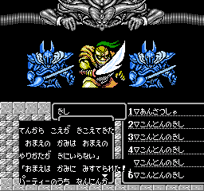

+++
title = "未使用の性格変更システム"
+++

本作には Wizardry 風の性格変更システムが実装された形跡がある。実際、[味方キャラ構造体](@/data-structure/hero/_index.md)を見ると性格を `0..=32` に細かく分けた値を持っている。しかし、ロジック的に性格変更コードは決して実行されない。

該当コードは PRG 29 `$ADB5` で、これは戦闘前フェイズで「たたかう」またはキャンセルを選んだ場合に実行される。このルーチンは「敵軍の友好判定を最大 3 回行い、1 回でも敵対判定が出たらPT全員の性格を悪側に寄せる」という内容になっている。しかし、PT全員の性格を悪側に寄せる下請けルーチン `$ADDE` を見ると、味方キャラの細かい性格を変更するコードのバグ(?)により実際には性格値が変更されない (`inc $7B` の後に `lda $7B` を入れ忘れている?)。

なお、チートでこの性格変更を発生させた場合は以下のように表示がバグるが、性格変更自体は正しく行われる。

